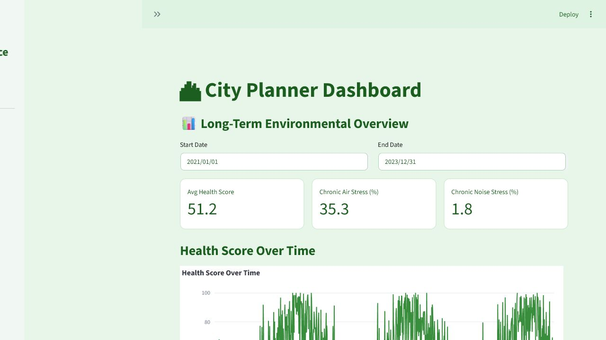

# Urban Pulse - Smart City Environmental Decision Engine

Urban Pulse is a Streamlit analytics dashboard built for the Future City hackathon. It helps city planners, controllers, and residents explore environmental stress in Heilbronn using air-quality, weather, and noise data.



The screenshot above was captured from the local Streamlit dashboard running on `localhost`.

## Key Features

- Role-based views for residents, smart city controllers, and city planners.
- Vectorized detection of air-risk episodes and night-noise disturbances.
- Tree Priority Index for identifying locations where green interventions can reduce environmental stress.
- Long-term health-score trends, pollutant charts, correlation analysis, and map-based planning views.
- Local data pipeline based on cleaned sensor data in `data/clean_data.csv`.

## Tech Stack

- Python
- Streamlit
- pandas and NumPy
- Plotly and PyDeck
- Matplotlib / Seaborn

## Quick Start

```powershell
py -3.11 -m venv .venv
.\.venv\Scripts\Activate.ps1
python -m pip install -U pip
pip install -r requirements.txt
pip install plotly pydeck pillow
streamlit run App\dashboard.py
```

Run from the repository root so the app can find `data/clean_data.csv` and the files under `App/`.

## Repository Structure

```text
App/dashboard.py       Main Streamlit dashboard
App/features.py        Health score, alert detection, and planning metrics
App/styles.css         UI styling
data/clean_data.csv    Cleaned local dataset used by the dashboard
data/processed/        Generated map/icon assets
```

## Practical Impact

The project turns environmental sensor streams into operational views: identifying bad-air and high-noise periods, summarizing long-term stress, and recommending where city greening interventions may matter most.
